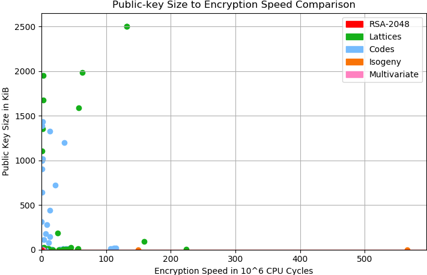
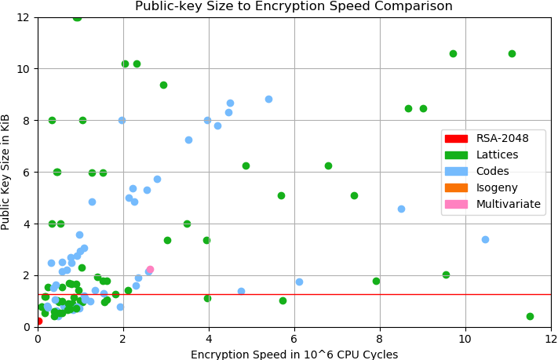

# PQ-plot

A small python script to plot post-quantum KEM benchmarks published on [safecrypto.eu](https://www.safecrypto.eu/pqclounge/software-analysis-kem/).

## Usage

```
usage: pqplot.py [-h] [-c CATEGORY] [-x XAXIS] [-y YAXIS] [-v] [-a] filename

Plot pq-kem data

positional arguments:
  filename              input file

optional arguments:
  -h, --help            show this help message and exit
  -c CATEGORY, --category CATEGORY
                        category of KEMs to plot
  -x XAXIS, --xaxis XAXIS
                        column of table to plot on x-axis
  -y YAXIS, --yaxis YAXIS
                        column of table to plot on y-axis
  -v, --verbose         increase output verbosity
  -a, --annotate        annotate nodes
```

## Example

The following command will open a matplotlib window containing a scatterplot of the csv
data:

```
./pqplot.py -c all-presentation -v NIST\ Software\ Performance\ Tests\ -\ KEM.csv -x "Enc Average" -y pk
```

The reslting plot looks as follows:



The interactive viewer can be used to further zoom and move the plot, as well as to
change the axis anotation and scale:



The interactive plot can easily be exported as png image using the save function.

## LEGAL

The pqplot.py script is released under the 2-clause BSD license, see [LICENSE](LICENSE).
The supplied csv file is taken from the [safecrypto.eu online pqc benchmarks](https://www.safecrypto.eu/pqclounge/software-analysis-kem/).

